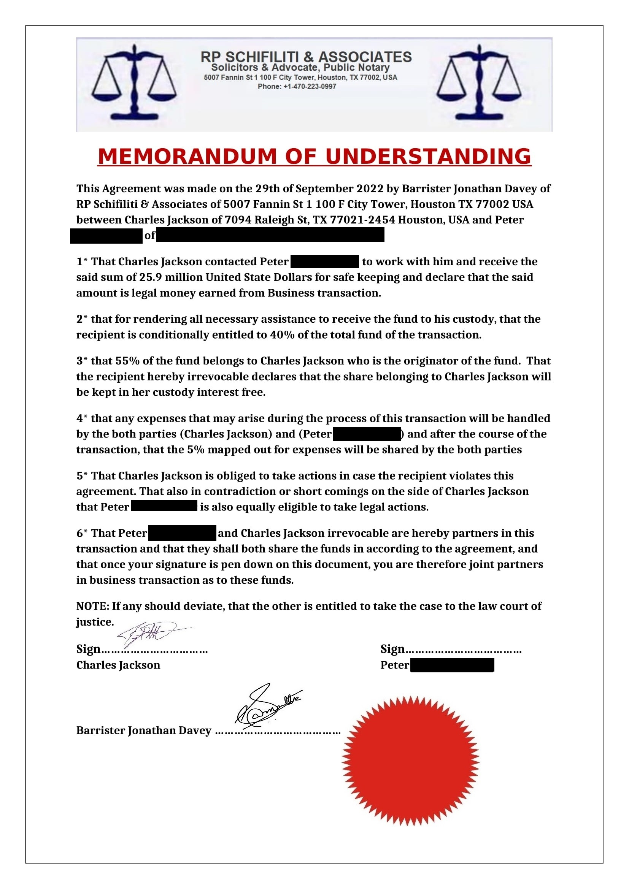
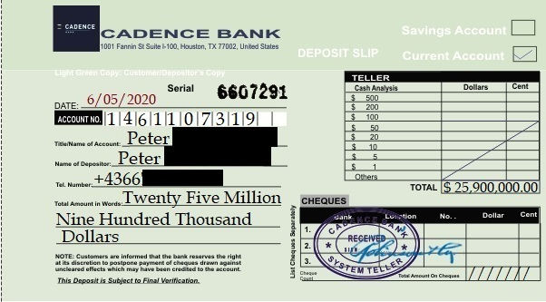
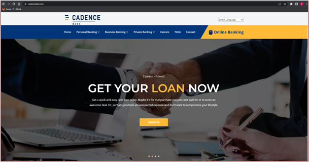
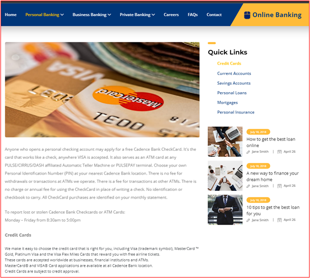
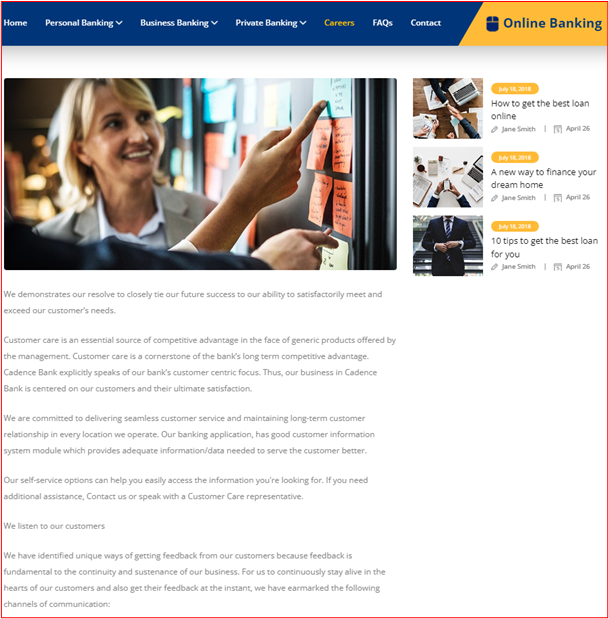
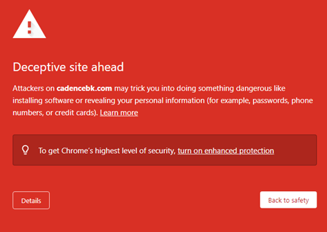
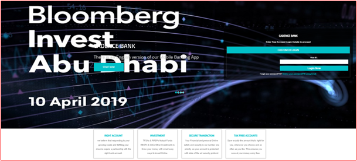

# Unterhaltung mit einem Scammer
Obwohl mein Postfach mit einem Spamfilter der neuesten Generation ausgestattet ist, schafft es gelegentlich eine Spam-Mail in mein Postfach. Da ich mich schon immer interessiert habe, wie die Scammer arbeiten.

# Kommunikations Geschichte

## Uhrzeit 20.09.2022 15:18  
Von `Charles Jackson <XXXXXXXXXXovic@gmail.com>`
```
--
Grüße

Mein Name ist Charles Jackson und ich habe ein interessantes Geschäftsangebot, das ich mit Ihnen besprechen möchte. Kontaktieren Sie mich bei Interesse.

Charles Jackson
```


## Uhrzeit 28.09.2022 14:57
An: jacksonwinster24@gmail.com  
Von: `Peter`

```
Hallo,

wie genau sieht ihr Angebot aus?

Mit freundlichen Grüßen
Peter 
```

## Uhrzeit 29.09.2022 07:42
An: `Peter`  
Von: jacksonwinster24@gmail.com  

```
Grüße Peter

Vielen Dank für Ihre E-Mail. Zuerst muss ich Ihr Vertrauen in diese Transaktion erbitten, da sie ihrer Natur nach streng geheim ist. Ich weiß, es mag Sie überraschen, aber ich entschuldige mich aufrichtig, wenn es in Ihre Privatsphäre eindringt. Mein Name ist Charles Jackson, Chief Data Analyst eines Finanzinstituts.

Ich schreibe, um Sie um Ihre Unterstützung bei der Überweisung von (fünfundzwanzig Millionen neunhunderttausend US-Dollar) 25,9 Millionen US-Dollar zu bitten. Dieser Betrag ist Teil der Gelder, die der verstorbene malaysische Investor vor seinem plötzlichen Tod im Jahr 2021 in den USA versteckt hat. Als Chief Data Verwahrer der Bank habe ich den Betrag geklont und auf ein Zwischenkonto ohne Begünstigten gelegt. Dadurch habe ich die Daten des ursprünglichen Begünstigten gelöscht und als nicht beanspruchte Gelder ohne Begünstigten gespeichert. Ich muss den Fonds als Investmentfonds aus unserer Bank auslagern. Hier brauche ich eure Hilfe.

Als Angestellter der Bank kann ich nicht direkt mit diesem Fonds in Verbindung stehen, daher bin ich gezwungen, Sie um Ihre Unterstützung zu bitten, um diesen Fonds auf Ihr Bankkonto zu überweisen. Ich beabsichtige, Ihnen 40 % dieses Fonds zu geben. Ich muss betonen, dass praktisch kein Risiko damit verbunden ist, daher wird es eine Bank-zu-Bank-Überweisung sein. Alles, was ich von Ihnen brauche, ist, als ursprünglicher Einleger dieses Fonds aufzutreten.

Ich werde Ihre rechtzeitige Antwort zu schätzen wissen und diesen Prozess zu einem sofortigen Abschluss einleiten, aber wenn diese Nachricht Ihre Ethik und moralischen Werte verletzt, vergessen Sie sie bitte und ich werde Sie nie wieder kontaktieren.

Grüße,
Charles Jackson
```

## Uhrzeit 29.09.2022 08:56
An: jacksonwinster24@gmail.com  
Von: `Peter`

```
Wie genau kann ich Ihnen helfen?

Gruß
Peter
```

## Uhrzeit 29.09.2022 09:33
An: `Peter`  
Von: jacksonwinster24@gmail.com  

```
Grüße Peter 

Danke für Ihre E-Mail. Ich kann Ihnen versichern, dass diese E-Mail an Sie für Sie bestimmt ist und legal ist und von illegalen Aktivitäten ferngehalten wird. Alles, was ich von dir brauche, ist dein Vertrauen.

Ich brauche Ihre Hilfe in zwei Bereichen, um diese Transaktion durchzuführen. Zuerst muss ich den Besitz von Geldern auf Ihren Namen ändern. Im Moment befinden sich die Gelder noch auf einem versteckten Konto, wo ich sie ohne Begünstigten oder Eigentum aufbewahrt habe. Damit ich dieses Geld erfolgreich überweisen kann, muss ich es auf Ihren Namen als Begünstigten registrieren. Keine Sorge, ich habe all diese Vorkehrungen getroffen, bevor ich Sie kontaktiert habe. Sobald dies geschehen ist, werde ich Ihnen Richtlinien geben, wie Sie meine Hauptgeschäftsstelle für den Fonds kontaktieren können. Zweitens werde ich Sie bei jedem Schritt anleiten, bis das Geld auf dem Konto gutgeschrieben ist, ich werde zu Ihnen fliegen, um Sie zum Teilen zu treffen. Obwohl ich auch vorhabe, einen beträchtlichen Teil meines Anteils in Ihrem Land zu investieren.

Ich werde meinerseits dafür sorgen, dass jede Anordnung rechtlich und ohne Umwege eingehalten wird. Ich kann Ihnen versichern, dass diese Transaktion reibungslos und risikofrei verläuft. Ich möchte meinen Namen nicht grundlos verbeulen, weil ich nach 11 Jahren aktiver Dienstzeit nach vollzogener Versetzung aus dem aktiven Dienst ausscheiden möchte. Daher ist es meine Pflicht, dafür zu sorgen, dass alle Vorkehrungen fehlerfrei funktionieren. Aber um dies zu erreichen, brauche ich Ihre Ehrlichkeit, Ihr Vertrauen, Ihr Engagement, Ihre Rechenschaftspflicht und Ihren absoluten Einsatz.
Deshalb fordere ich Sie auf, mir folgende Informationen zuzusenden.

1. Ihr vollständiger rechtsgültiger Name
2. Eine Kopie Ihres Reisepasses
3. Ihre Mobiltelefonnummer
4. Alter
5. Beruf
6. Anschrift des Einwohners

Ich würde gerne bald von Ihnen hören, damit wir mit dem ersten Schritt beginnen können. Jeder unserer Schritte sollte von Prinzipien und Vorsicht geleitet werden, damit wir die Gelder nicht preisgeben. Wir freuen uns, bald von Ihnen zu hören.

Grüße.
Charles Jackson
```

## Uhrzeit 29.09.2022 13:43
An: jacksonwinster24@gmail.com  
Von: `Peter`

```
Hallo Carles,

Hier sind meine Daten

1.	Ihr vollständiger rechtsgültiger Name
Peter 
2.	Eine Kopie Ihres Reisepasses
Leider kann ich keinen Fotos direkt schicken. Das aktuelle Foto liegt in meiner Cloud
https://bit.ly/XXXXXX 

3.	Ihre Mobiltelefonnummer
+4366FAKE
4.	Alter
64
5.	Beruf
Buchhalter
6.	Anschrift des Einwohners
XXXX 125
XXXX Salzburg

Was muss ich als nächstes tun?

Gruß
Peter
```

## Uhrzeit 30.09.2022 07:18
An: `Peter`  
Von: jacksonwinster24@gmail.com  

```
Grüße Peter 

Vielen Dank für Ihre erhaltenen Angaben. Ich habe von meinem Anwalt eine Absichtserklärung erstellen lassen, die als Vereinbarung über diese Transaktion gilt.
Hier ist das Memorandum of Understanding beigefügt. Bitte gehen Sie es durch, unterschreiben Sie es und senden Sie es an mich zurück.
Ich freue mich darauf, bald von Ihnen zu hören

Grüße.
Charles Jackson
```

### Attachment



## Uhrzeit 30.09.2022 10:36
An: jacksonwinster24@gmail.com  
Von: `Peter`

```
Hallo Charles,

Ich habe das unterzeichnende Dokument auf meinen Cloud Speicher geladen. https://bit.ly/XXXXXX

Gruß
Peter
```

## Uhrzeit 30.09.2022 10:57
An: `Peter`  
Von: jacksonwinster24@gmail.com  

```
Grüße Peter 

Tut mir leid, dass ich die unterschriebene Absichtserklärung nicht von Ihrer Icloud erhalten konnte.

Bitte fügen Sie das unterschriebene MOU bei und senden Sie es mir per E-Mail sowie eine Kopie Ihres Reisepasses.

Ich freue mich darauf, bald von Ihnen zu hören

Grüße.
Charles Jackson 
```

## Uhrzeit 30.09.2022 12:07
An: jacksonwinster24@gmail.com  
Von: `Peter`

```
Hallo Charles,

wir können leider in unseren IT System keine Anhänge verschicken. Wir verwenden unsere neue Cloud.

https://XXXXX/XXXXX.php

LG
Peter
```

## Uhrzeit 30.09.2022 15:30
An: `Peter`  
Von: jacksonwinster24@gmail.com  

```
Grüße Peter 
Ich kann immer noch nicht auf das Dokument zugreifen
Gibt es keine andere Möglichkeit, wie Sie mir dieses Dokument zusenden können?

Grüße.
Charles Jackson
```

## Uhrzeit 06.10.2022 07:26
An: `Peter`  
Von: jacksonwinster24@gmail.com  

```
Liebe Grüße Peter 

Heute konnten mein Kollege und ich ein Konto in Ihrem Namen eröffnen und haben einen Betrag von 25.900.000,00 USD auf das Konto gutgeschrieben bekommen. Wir haben den Einzahlungsschein rückdatiert und Ihren Namen darauf verschlüsselt.

Wenden Sie sich daher bezüglich des Geldes, das Sie 2020 bei der Cadence Bank eingezahlt haben, an die Bank, als Sie die USA für geschäftliche Investitionen besuchten. Sie müssen ihnen mitteilen, dass Sie das Geld auf Ihr Konto in Österreich überweisen möchten
Nachfolgend finden Sie die Bankdaten und Ansprechpartner.

Bankname: Cadence Bank.
E-Mail: internationalremitance@cadencebk.com
Bankadresse: 1001 Fannin St 1 100
First City Tower, Houston, TX 77002, USA.
Telefon: +1-318-370-1523
Fax: +17163587066
Kontakt: Owen Benjamin

Sobald Sie Kontakt mit der Bank aufgenommen haben, lassen Sie es mich bitte wissen und denken Sie daran, dass meine Bank möglicherweise nicht weiß, dass ich involviert bin. Wir müssen alle unsere Bewegungen mit Prinzipien und Vorsicht durchführen, um keine Gelder offenzulegen.

Grüße
Charles Jackson
```

### Attachment


### Analyse der Daten
Die Faxnummer funktioniert nicht, aber die Telefonnummer existiert und gehört zu einen VOIP Provider der Gratis VOIP Anschlüsse zum Testen anbietet.

#### Fake Bank
Die Webseite ist der umfangreich, daher habe ich nicht von jeder Seite einen Screenshot erstellt.






#### Analyse der Domain cadencebk.com
```
cadencebk.com
www.cadencebk.com

cpcontacts.secured.cadencebk.com
mail.cadencebk.com
cpanel.cadencebk.com
webmail.secured.cadencebk.com
cpcalendars.secured.cadencebk.com
cpcontacts.cadencebk.com
autodiscover.cadencebk.com
secured.cadencebk.com
webmail.cadencebk.com
webdisk.secured.cadencebk.com
webdisk.cadencebk.com
cpcalendars.cadencebk.com
www.secured.cadencebk.com
cpanel.secured.cadencebk.com

DNS record for 192.99.19.65: ca.hostbuddy.cloud
Not shown: 985 filtered tcp ports (no-response)
PORT     STATE SERVICE
21/tcp   open  ftp
22/tcp   open  ssh
25/tcp   open  smtp
53/tcp   open  domain
80/tcp   open  http
110/tcp  open  pop3
111/tcp  open  rpcbind
143/tcp  open  imap
443/tcp  open  https
465/tcp  open  smtps
587/tcp  open  submission
993/tcp  open  imaps
995/tcp  open  pop3s
3306/tcp open  mysql
5960/tcp open  unknown

Host script results:
| dns-brute: 
|   DNS Brute-force hostnames: 
|     mail.cadencebk.com - 192.99.19.65
|     www.cadencebk.com - 192.99.19.65
|_    ftp.cadencebk.com - 192.99.19.65

```

#### WHOIS
```
Domain Name: cadencebk.com
Registry Domain ID: 2668195031_DOMAIN_COM-VRSN
Registrar WHOIS Server: whois.ccdomain.co.kr
Registrar URL: http://www.cosmotown.com
Updated Date: 2022-01-18T04:24:38Z
Creation Date: 2022-01-14T05:14:55Z
Registrar Registration Expiration Date: 2023-01-14T05:14:55Z
Registrar: COSMOTOWN, INC.
Registrar IANA ID: 1509
Registrar Abuse Contact Email:  
Registrar Abuse Contact Phone: +1.6504739500
Domain Status: clientDeleteProhibited http://icann.org/epp#clientDeleteProhibited
Domain Status: clientTransferProhibited http://icann.org/epp#clientTransferProhibited
Domain Status: clientRenewProhibited http://icann.org/epp#clientRenewProhibited
Domain Status: clientUpdateProhibited http://icann.org/epp#clientUpdateProhibited
Registrant Organization: 
Registrant State/Province: ca
Registrant Country: US
Registrant Email:  
Admin Email:  
Tech Email:  
Name Server: n1.hostbuddy.cloud
Name Server: n2.hostbuddy.cloud
DNSSEC: unsigned
URL of the ICANN WHOIS Data Problem Reporting System: http://wdprs.internic.net/
>>> Last update of WHOIS database: 2022-01-18T04:24:38Z <<<

For more information on Whois status codes, please visit https://www.icann.org/resources/pages/epp-status-codes-2014-06-16-en.

Notes: Port43 will provide the ICANN-required minimum data set per ICANN Temporary Specification, adopted 17 May 2018.

The Data in the COSMOTOWN, INC. WHOIS database is provided by COSMOTOWN, INC. for information purposes, and to assist persons in obtaining information about or related to a domain name registration record. COSMOTOWN, INC. does not guarantee its accuracy.  By submitting a WHOIS query, you agree that you will use this Data only for lawful purposes and that, under no circumstances will you use this Data to:  (1) allow, enable, or otherwise support the transmission of mass unsolicited, commercial advertising or solicitations via e-mail (spam); or (2) enable high volume, automated, electronic processes that apply to COSMOTOWN, INC.. (or its systems). COSMOTOWN, INC. reserves the right to modify these terms at any time.  By submitting this query, you agree to abide by this policy.


Information Updated: 2022-10-18 09:39:11
```


## Uhrzeit 10.10.2022 09:41
An: `Peter`  
Von: jacksonwinster24@gmail.com  

```
Liebe Grüße Peter 

Wie geht es dir und wie geht es der Familie?
Hast du die Bank kontaktiert?

Grüße
Charles Jackson
```

## Uhrzeit 10.10.2022 15:23
An: jacksonwinster24@gmail.com  
Von: `Peter`

```
Hallo Charles,

Danke mir geht es gut und dir?
Ich habe ein Fax an die Bank geschickt, aber noch keine Antwort bekommen.

Grüße
Peter 
```

Die Faxnummer aus der vorherigen E-Mail habe ich ausprobiert. Wie erwartet gibt es die Nummer nicht. Daher wollte ich die Reaktion abwarten.

## Uhrzeit 10.10.2022 15:31
An: `Peter`  
Von: jacksonwinster24@gmail.com  

```
Liebe Grüße Peter 

In Ordnung, aber ich schlage vor, Sie schicken ihnen eine E-Mail.
So geht es schneller.
Denken Sie daran, dass die Bank nicht wissen muss, dass ich daran beteiligt bin

Grüße
Charles Jackson
```

## Uhrzeit 10.10.2022 15:37
An: jacksonwinster24@gmail.com  
Von: `Peter`

```
Hallo Charles,

ok, ich habe soeben eine E-Mail geschickt. Wie lange brauchen die für die Antwort?

Gruß
Peter 
```

Ich gehe davon aus das der Kontakt `Owen Benjamin` und `Charles Jackson` die gleiche Person sind. Daher habe ich nur behauptet, dass ich eine E-Mail an den Herrn `Owen Benjamin` geschickt habe.

## Uhrzeit 10.10.2022 15:45
An: `Peter`  
Von: jacksonwinster24@gmail.com  

```
Liebe Grüße Peter 

Hast du Owen Benjamin eine E-Mail geschickt?

Bankname: Cadence Bank.
E-Mail: internationalremitance@cadencebk.com
Bankadresse: 1001 Fannin St 1 100
First City Tower, Houston, TX 77002, USA.
Telefon: +1-318-370-1523
Fax: +17163587066
Kontakt: Owen Benjamin

Grüße
Charles Jackson
```

## Uhrzeit 10.10.2022 16:02
An: jacksonwinster24@gmail.com  
Von: `Peter`

```
Hallo Charles,

ich habe bereits eine Mail geschrieben. Ist die schon angekommen?

LG
Peter
```

## Uhrzeit 10.10.2022 16:27
An: jacksonwinster24@gmail.com  
Von: `Peter`

```
Hallo Charles,

wie lautet meine UserID und Passwort für das Online banking.

LG
```

## Uhrzeit 11.10.2022 13:29
An: internationalremitance@cadencebk.com  
Von: `Peter`

```
Hallo Herr Owen,

ich möchte gern mein Geld auf ein österreichisches Konto überweisen. Was benötigen Sie dazu?

Mit freundlichen Grüßen
Peter
```

## Uhrzeit 12.10.2022 16:02
An: jacksonwinster24@gmail.com  
Von: `Peter`

```
Hallo Charles,

ich habe mich bei der E-Mail-Adresse vertippt, daher ging die erste Mail nicht durch. Gestern habe ich eine neue Mail geschrieben, aber darauf habe ich noch keine Antwort bekommen.

LG
Peter
```

## Uhrzeit 13.10.2022 12:42
An: `Peter`  
Von: Cadence Bank <smithkingston@cadencebk.com> 

```
Dear Valued Customer (Peter )

We acknowledged your email and the content noted.
Kindly indicate your request so that we can act on it.

We sincerely hope the above information is helpful to you. Kindly make your choice from the above information and inform us with details to proceed. 
If you have any questions and further clarification(s) do not exit-ate to notify us.
At Cadence Bank, we appreciate the opportunity to serve you better.
From, Mr. Smith Kingston.

Bank address: 1001 Fannin St 1 100
First City Tower, Houston, TX 77002, USA.
Tel: +12017011049
Fax: +17163587066

Thank you for choosing Cadence Bank of the United States of America.

The Information contained and transmitted by this E-MAIL is proprietary to Cadence Bank and/or its Customer and is intended for use only by the individual or entity to which it is addressed, and may contain information that is privileged, confidential or exempt from a disclosure under applicable law. If this is a forwarded message, the content of this E-MAIL may not have been sent with the authority of the Bank. Cadence Bank shall not be liable for any mails sent without due authorization or through unauthorized access. If you are not the intended recipient, an agent of the intended recipient or a person responsible for delivering the information to the named recipient, you are notified that any use, distribution, transmission, printing, copying or dissemination of this information in any way or in any manner is strictly prohibited. If you have received this communication in error, please delete this mail and notify us immediately at Cadence Bank
```

## Uhrzeit 14.10.2022 09:39
An: `Peter`  
Von: jacksonwinster24@gmail.com  

```
Liebe Grüße Peter 

Wie geht es dir und wie geht es der Familie?
Was ist los und warum habe ich nichts von dir gehört?
Hat die Bank Sie nicht kontaktiert?
Bitte überprüfen Sie Ihren Müll und sehen Sie, ob die Bankpost dort versagt.
Bin besorgt.

Grüße
Charles Jackson
```

## Uhrzeit 14.10.2022 10:35
An: jacksonwinster24@gmail.com  
Von: `Peter`

```
Danke mir geht es gut und dir?

Bei mir war die Mail im Junk Ordner, hab das erst jetzt gesehen

Mein English ist nicht perfekt, was genau soll ich der Bank schreiben?

LG
Peter
```

## Uhrzeit 14.10.2022 13:11
An: `Peter`  
Von: jacksonwinster24@gmail.com  

```
Liebe Grüße Peter 

Oh wie schön, Sie werden die Bank anschreiben und ihr mitteilen, dass Sie möchten, dass Ihr Geld, das Sie im Jahr 2020 bei der Cadence Bank eingezahlt haben, an Sie in Österreich überwiesen wird, und dass Sie darum bitten, dass alle erforderlichen Verfahren unverzüglich erledigt werden.
und welche Anforderungen erfüllt werden müssen, um die Übertragung abzuschließen.

Senden Sie ihnen sofort eine E-Mail und halten Sie mich über ihre Antwort auf dem Laufenden.

Grüße
Charles Jackson

```

## Uhrzeit 14.10.2022 14:21
An: Cadence Bank <smithkingston@cadencebk.com> 
Von: `Peter`  
```
Hello,

i want to transfer all my money to my new account in Austria. Which information did you need from me?

Best regards
Peter

```

## Uhrzeit 14.10.2022 14:22
An: jacksonwinster24@gmail.com  
Von: `Peter`

```
Hab eine Mail an die Bank verfasst. Mal schauen was mir die Bank zurückschreibt
```

## Uhrzeit 14.10.2022 15:08
An: `Peter`  
Von: Cadence Bank <smithkingston@cadencebk.com> 

```
Dear Valued Customer (Peter )

We acknowledged your letter and we will act accordingly to your request.
To enable us commence the transfer of your fund to your account in Austria, You will have to provide the Non Residential Clearance Certificate and and provide us with your Austria Account information where your fund with the Cadence bank can me remitted to.
 
To enable you obtain the Non Residential Clearance Certificate, You will have to contact Mr. Sing Tom and request for the certificate, Once you receive the certificate, Do kindly send it to this office along with a copy of your identity card.
 
Contact Person: Mr. Sing Tom
Email: mr.singtom@gmail.com
 
If you have any questions and further clarification(s) do not exit-ate to notify us.
At Cadence Bank, we appreciate the opportunity to serve you better.
From, Mr. Smith Kingston.
Bank address: 1001 Fannin St 1 100
First City Tower, Houston, TX 77002, USA.
Tel: +12017011049
Fax: +17163587066

Thank you for choosing Cadence Bank of the United States of America.

The Information contained and transmitted by this E-MAIL is proprietary to Cadence Bank and/or its Customer and is intended for use only by the individual or entity to which it is addressed, and may contain information that is privileged, confidential or exempt from a disclosure under applicable law. If this is a forwarded message, the content of this E-MAIL may not have been sent with the authority of the Bank. Cadence Bank shall not be liable for any mails sent without due authorization or through unauthorized access. If you are not the intended recipient, an agent of the intended recipient or a person responsible for delivering the information to the named recipient, you are notified that any use, distribution, transmission, printing, copying or dissemination of this information in any way or in any manner is strictly prohibited. If you have received this communication in error, please delete this mail and notify us immediately at Cadence Bank

```

## Uhrzeit 14.10.2022 15:35
An: `Peter`  
Von: jacksonwinster24@gmail.com  

```
Liebe Grüße Peter 

In Ordnung, ich warte auf Ihre Antwort und überprüfe immer Ihren Junk, um zu sehen, ob die Bank Ihnen geschrieben hat.

Grüße
Charles Jackson
```

## Uhrzeit 17.10.2022 09:05
An: `Peter`  
Von: jacksonwinster24@gmail.com  

```
Liebe Grüße Peter 

Mein guter Freund und Bruder, wie geht es dir heute und wie war dein Wochenende? Frohe neue Woche und ich hoffe, diese Woche bringt uns gute Nachrichten.
Wie ist die Situation zu diesem Zeitpunkt?
Hast du von der Bank gehört?

Grüße
Charles Jackson
```

## Uhrzeit 17.10.2022 11:29
An: `Peter`  
Von: Cadence Bank <smithkingston@cadencebk.com> 

```
Dear Valued Customer (Peter )

We acknowledged your letter and we will act accordingly to your request.
To enable us commence the transfer of your fund to your account in Austria, You will have to provide the Non Residential Clearance Certificate and and provide us with your Austria Account information where your fund with the Cadence bank can me remitted to.
 
To enable you obtain the Non Residential Clearance Certificate, You will have to contact Mr. Sing Tom and request for the certificate, Once you receive the certificate, Do kindly send it to this office along with a copy of your identity card.
 
Contact Person: Mr. Sing Tom
Email: mr.singtom@gmail.com
 
If you have any questions and further clarification(s) do not exit-ate to notify us.
At Cadence Bank, we appreciate the opportunity to serve you better.
From, Mr. Smith Kingston.
Bank address: 1001 Fannin St 1 100
First City Tower, Houston, TX 77002, USA.
Tel: +12017011049
Fax: +17163587066

Thank you for choosing Cadence Bank of the United States of America.

The Information contained and transmitted by this E-MAIL is proprietary to Cadence Bank and/or its Customer and is intended for use only by the individual or entity to which it is addressed, and may contain information that is privileged, confidential or exempt from a disclosure under applicable law. If this is a forwarded message, the content of this E-MAIL may not have been sent with the authority of the Bank. Cadence Bank shall not be liable for any mails sent without due authorization or through unauthorized access. If you are not the intended recipient, an agent of the intended recipient or a person responsible for delivering the information to the named recipient, you are notified that any use, distribution, transmission, printing, copying or dissemination of this information in any way or in any manner is strictly prohibited. If you have received this communication in error, please delete this mail and notify us immediately at Cadence Bank

```

Nocheinmal die gleiche E-Mail wie vom 14.10.2022 15:08

## Uhrzeit 17.10.2022 17:20
An: mr.singtom@gmail.com  
Von: `Peter`

```
Hello Tom,

I need for my bank a Non Residential Clearance Certificate. Which information did you need from me.

Best regards
Peter
```

## Uhrzeit 17.10.2022 17:49
An: jacksonwinster24@gmail.com  
Von: `Peter`

```
Hallo Charles,

ja, ich habe am Freitag eine Antwort bekommen. Ich muss mich bei einen Herrn Sing Tom melden. Kennst du diese Person?
Und was ist ein „Non Residential Clearance Certificate“?

Ich kenne mich damit nicht aus.

Gruß
Peter
```

## Uhrzeit 17.10.2022 18:53
An: `Peter`  
Von: mr.singtom@gmail.com  

```
Hello Peter 

With reference to your email received, The Non Residential Clearance certificate is obtainable for fund transfer and its mandatory since you're not a citizen of America.
I have acknowledged your request and have placed 73789 code for the certificate to be made available in your name.
You have been charged the sum of $9,950 USD for the certificate and payment must be made within 48 hours.
You are to provide the following immediately.

1. Copy of your passport or Identity card.
2. Your full legal name
3. Country of Origin
4. Country of resident

I look forward to hearing from you soon so as to make available the details to the Admin department at once.
If you do have any further questions, Don't hesitate to contact me.

Your Sincerely
Mr. Sing Tom
```

## Uhrzeit 17.10.2022 19:23
An: `Peter`  
Von: jacksonwinster24@gmail.com  

```
Liebe Grüße Peter 

Vielen Dank, dass Sie sich die Zeit genommen haben, mich zu kontaktieren. Gut zu hören, dass die Bank Sie kontaktiert hat, das heißt, wir sind auf dem richtigen Weg und bevor die Woche überschritten wird, sollte das Guthaben auf Ihrem Konto sein.

Ich kenne Herrn Tom nicht.
Hat die Bank geschrieben, dass Sie das Non-Residential Certificate vorlegen sollen?

Das Zertifikat deckt die Zollabfertigung ab, die von Nicht-Bürgern zu entrichten ist, die das Hauptmandat des Regierungsgesetzes überschreiten. Da das Guthaben auf dem Konto über dem angegebenen Betrag liegt, muss das Zertifikat eingeholt werden.

Haben Sie Herrn Tom kontaktiert?
Was ist seine Antwort?

Grüße
Charles Jackson
```

## Uhrzeit 18.10.2022 09:02
An: jacksonwinster24@gmail.com  
Von: `Peter`

```
Hallo Charles,

ja, ich habe eine Antwort von Herrn Tom bekommen. Er benötigt mehr Daten von mir und das Zertifikat kostet 9,950 USD

Wie kann ich mir die Kosten sparen? Kannst du mir nicht ein Konto bei einer US Bank erstellen?

Das ist hat mir Herr Tom geschrieben,
    Hello Peter 

    With reference to your email received, The Non Residential Clearance certificate is obtainable for fund transfer and its mandatory since you're not a citizen of America.
    I have acknowledged your request and have placed 73789 code for the certificate to be made available in your name.
    You have been charged the sum of $9,950 USD for the certificate and payment must be made within 48 hours.
    You are to provide the following immediately.

    1. Copy of your passport or Identity card.
    2. Your full legal name
    3. Country of Origin
    4. Country of resident

    I look forward to hearing from you soon so as to make available the details to the Admin department at once.
    If you do have any further questions, Don't hesitate to contact me.

    Your Sincerely
    Mr. Sing Tom


LG
Peter
```

## Uhrzeit 18.10.2022 09:25
An: mr.singtom@gmail.com  
Von: `Peter`

```
Hello Tom,

The charge is very high. Is there a way to go without the certificate?

Best regards
```

## Uhrzeit 18.10.2022 09:37
An: `Peter`  
Von: mr.singtom@gmail.com  

```
Hello Peter 

With reference to your email, the certificate is mandatory and must be obtained.
I will suggest you pay half the fee today and i will plead on your behalf with the admin department to issue the certificate and let the bank complete the transfer, Then once the fund is remitted to your account, You can then pay the balance, if they accept then that is the other option to get your fund transferred. 

Your Sincerely
Mr. Sing Tom
```

## Uhrzeit 18.10.2022 09:41
An: `Peter`  
Von: jacksonwinster24@gmail.com  

```
Liebe Grüße Peter 

Ich habe den Brief von Herrn Tom gesehen und muss sagen, dass die Gebühr hoch ist. Wie können Sie dann eine solche Gebühr in 48 Stunden bezahlen?

Können Sie die Gebühr bezahlen, damit wir das Zertifikat erhalten und die Bank die Überweisung abschließen kann?
Sie sind sich bewusst, dass wir diesen Vorgang diese Woche abschließen und die Bank den Betrag auf Ihr Konto überweisen müssen.

Bitte, was machen wir jetzt?

Grüße
Charles Jackson
```

## Uhrzeit 18.10.2022 09:45
An: mr.singtom@gmail.com  
Von: `Peter`

```
Hello Tom,

I have also a bank account in Germany. Is the transfer to Germany cheaper?

Br
Peter
```

## Uhrzeit 18.10.2022 09:55
An: `Peter`
Von: mr.singtom@gmail.com  

```
Hello Peter 

Your account requires the Non Residential Certificate. Once the certificate is obtained and the code is input into your account, Your fund can be transferred to any account in the world.
It doesn't matter which bank or country you intend transferring the fund to, What is required now is the certificate so as to get the clearance code and initiate a transfer.
Are you ready to make the payment?

Your Sincerely
Mr. Sing Tom

```

## Uhrzeit 18.10.2022 11:00
An: jacksonwinster24@gmail.com  
Von: `Peter`

```
Hallo Charles,

wäre es möglich, dass man das Geld in Form von Goldbaren auszahlt?
Haben wir nicht mehr Zeit zum Abwickeln?

Gruß
Peter
```

## Uhrzeit 18.10.2022 11:02
An: jacksonwinster24@gmail.com  
Von: `Peter`

```
ich plane einen Urlaub in den USA und dann hol ich das Gold ab. Damit könnte ich die Gebühren sparen.

Gruß
Peter
```

## Uhrzeit 18.10.2022 11:04
An: mr.singtom@gmail.com  
Von: `Peter`

```
Hi Tom,

i must talk to my financial advisor.

Br 
Peter
```

## Uhrzeit 18.10.2022 11:29
An: `Peter`  
Von: jacksonwinster24@gmail.com  

```
Liebe Grüße Peter 

Damit wir diesen Fonds nicht verzögern und aufdecken, empfehle ich, dass wir ihn sofort sortieren.

Aus dem Brief, den Herr Tom geschickt hat, geht hervor, dass wir nur 48 Stunden Zeit haben, um die Zahlung zu leisten, und ich habe meine Frau angewiesen, zu sehen, wie wir Geld sammeln können. Da wir nur 48 Stunden Zeit haben, können wir nicht bis zu Ihrer Urlaubszeit warten, und vorher haben wir das Geld verloren, wenn wir nicht schnell handeln.

Wie viel haben Sie im Moment, damit wir diese Gebühr regeln können?

Grüße
Charles Jackson
```

## Uhrzeit 18.10.2022 13:06
An: jacksonwinster24@gmail.com  
Von: `Peter`

```
Hallo Charles,

ich habe derzeit nicht viel auf mein Konto. Ich müsste mein Sparbuch blündern, aber dazu muss ich noch zu meiner Bank.

Wieviel Geld kannst du mir überweisen?
Soll ich dir meine Kontonummer schicken!?

Gruß
Peter
```

## Uhrzeit 18.10.2022 13:20
An: `Peter`  
Von: jacksonwinster24@gmail.com  

```
Liebe Grüße Peter 

Sie dürfen mir Ihre Kontonummer nicht zusenden.

Das sollen wir partnerschaftlich erarbeiten.
Ich habe mit meinem Anwalt Jonathan Davey gesprochen, um zu sehen, wie er das Geld erhalten und die Zahlung direkt vornehmen kann, um das Zertifikat sofort zu erhalten.
Also sollten wir sehen, wie wir beide den Fonds aufbringen und die Gebühr bezahlen können.
Können Sie die Hälfte der Gebühr erheben, während ich den Restbetrag erhebe?

Grüße
Charles Jackson 
```

## Uhrzeit 18.10.2022 13:46
An: jacksonwinster24@gmail.com  
Von: `Peter`

```
Hallo Charles,

ich bin noch ein wenig skeptisch. Kann ich dir voll und ganz vertrauen?
Kannst du mir mehr Daten von dir schicken, wie dein Reisepass, Foto von deiner aktuellen Tageszeitung…

Gruß
Peter
```

## Uhrzeit 18.10.2022 13:48
An: mr.singtom@gmail.com  
Von: `Peter`

```
Hi Tom,

can you send me the account number? I must talk to my financial advisor, but I think, I can pay the half of the funds. 

Br
Peter
```

## Uhrzeit 18.10.2022 14:23
An: `Peter`  
Von: jacksonwinster24@gmail.com  

```
Liebe Grüße Peter 

Ich war so schockiert, als ich Ihre Post erhielt, als ob Sie mir von Beginn dieser Transaktion an nicht vertrauen würden und wir kommuniziert hätten.
Wie kommt es, dass ich Ihnen vertraute und Ihnen meine millionenschweren Transaktionen übergab, wohl wissend, dass Sie mich nicht verraten werden. Ich bitte Sie, sich an die Anweisungen zu halten, damit wir keine Fehler machen.
Sobald ich zu Hause bin, schicke ich Ihnen eine Kopie meines Reisepasses.
Wie geht es jetzt weiter?

Grüße
Charles Jackson
```

## Uhrzeit 18.10.2022 14:36
An: `Peter`  
Von: jacksonwinster24@gmail.com  

```
Liebe Grüße Peter 

Ich konnte 1.200 USD sammeln.
Wie viel hast du zusammenbringen können?

Grüße
Charles Jackson
```
